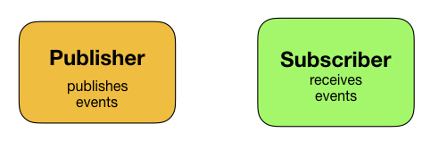
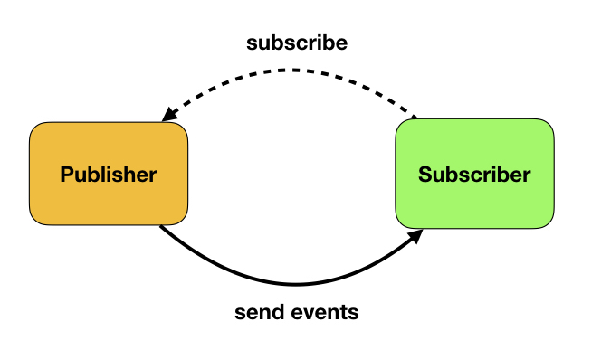
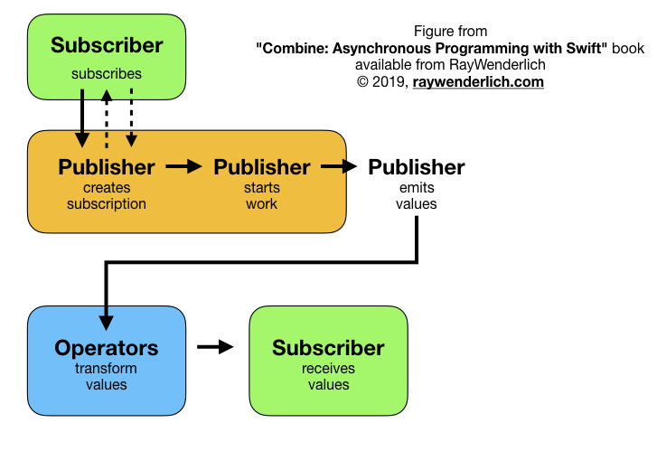

# Introduction to Combine


<BR><BR><BR><BR>
`https://github.com/fpillet/SwiftAlps2019`


<BR><BR><BR>
#### Florent Pillet - [@fpillet](https://twitter.com/fpillet)
#### 🇨🇭 SwiftAlps 🧀 2019
###### some workshop material by Antoine Van Der Lee - [@swiftlee](https://twitter.com/swiftlee) 🙌

---
# Asynchronous programming


### Reacting to events, data & change

---
# Asynchronous events, data & change

```swift
NotificationCenter.default
    .addObserver(forName: someNotification,
                 object: nil,
                 queue: DispatchQueue.main) { notification in
    print("notifcation \(notification) received")
}

// ...

NotificationCenter.default
    .removeObserver(nil,
                    name: someNotification,
                    object: nil)
```

---
# Asynchronous events, data & change

```swift
button.addTarget(self,
                 action: @selector(buttonTapped:), 
                 for: .touchUpInside)

// ...

button.removeTarget(self
                    action: @selector(buttonTapped:), 
                    for: .touchUpInside)
```

---
# Asynchronous events, data & changes

```swift
@objc class MyClass: NSObject {
    @objc dynamic var someVar: Int
}

a.observe(\.someProperty) { (object, change) in
	print("Object \(object) property changed: \(change)")
}
```

---
# Asynchronous events, data & change

```swift
let url = URL(string: "https://www.apple.com")!

let task = URLSession.shared
	.dataTask(with: url) { 
        (data, response, error) in
        if let data = data {
            print("Got data \(data)")
        } else {
        	print("Got \(response), error \(error)")
        }
}

task.resume()
```

---
# Asynchronous events, data & change

```swift
let timer = Timer.scheduledTimer(withTimeInterval: 0.5, repeats: true) { timer in
	print("Timer fired")
}

DispatchQueue.main.asyncAfter(deadline: .now() + 2) {
	timer.invalidate()
}
```

---
# Asynchronous events, data & change

→ Notifications
→ Delegate pattern
→ Key-Value Observing
→ Dispatch queues (closures)
→ Run Loops (selectors)
→ User interface

---
# Asynchronous events, data & change

Caveats:

* Error propagation?
* Typed data?
* Cancellation?
* No data?
* Transform / compose?

---
# Introducing Combine



---
# Introducing Combine



---
# Introducing Combine



---
# Type data, typed errors

Expressive typed data and typed errors

```swift
enum MyError: Error {
    // ...
}

Publisher<Int, MyError>

Publisher<Int, Never>
```

---
# Cancellable subscriptions

```swift
let subscription = publisher.sink {
    print("Value received: \($0)")
}

subscription.cancel()
```

---
# Hot and cold publishers

🔥 Hot: existing streams of events
     ➟ Notifications
     ➟ UI events
     ➟ Status (hardware, network, etc)
     

❄️ Cold: starts work at subscription
    ➟ Network request
    ➟ Timer
    ➟ Computation
    ➟ File or DB read/write

---
# Declarative constructs

```swift
let subscription = session.dataTaskPublisher(for: url)

    .map { data, response in data }

    .decode(MyType.self, decoder: JSONDecoder())

    .assign(to: \.someProperty, on: self)
```

---
# What for?

* Network requests
* Database operations
* Combining multiple async sources
* Unidirectional data flow
* UI update on state change
* Long computations
* ... Anything asynchronous!

---
# When to use Combine?

* Start small!
* Don't force usage everywhere
* Naturally fits with SwiftUI (`@published`)
* No UIKit bindings 🙁

---
# Let's learn!

---
# Playground

---
# Workshop App

## Step 1

Enable button on switch value change

---
# Workshop App

## Step 1

Hint: use `@Published`

---
# Workshop App

## Step 2

Enable button when the three switches are ON

---
# Workshop App

## Step 2

Hint: use `Publishers.CombineLatest`

---
# Workshop App

## Step 3

Validate signup form

---
# Workshop App

## Step 3

Hint: learn about `flatMap`

---
# Workshop App

## Step 4

A real life situation!

---
# Workshop App

## Step 4

Hint: vertically align operators to see the processing flow
